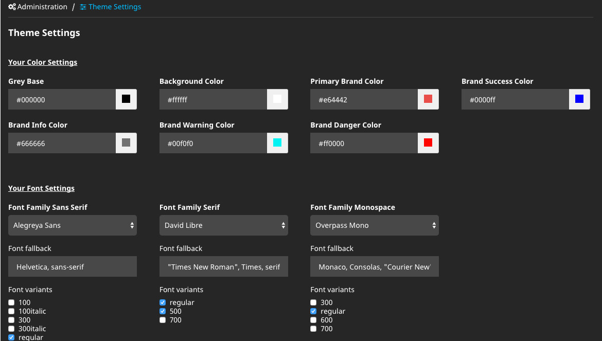
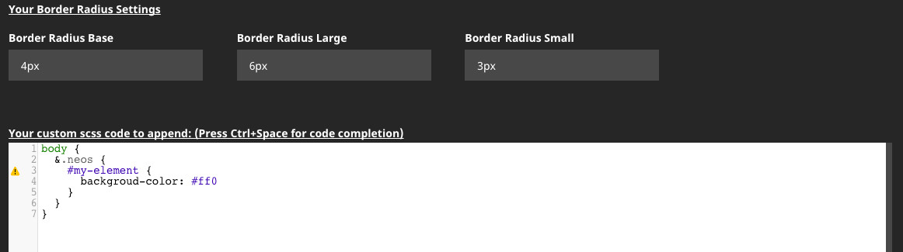

# Backend Site/Theme Module for Neos

This packages allows you to customize your theme package in a backend module.

## Features

* Fully customizable, predefine any SCSS variables
* Support for bootstrap, foundation and many more
* Change colors and fonts in the backend of Neos
* Add custom additional SCSS/CSS code
* Render your SCSS files
* No dependencies to sass compiler libraries
* Additional ViewHelper
* Support for Google Webfonts
* Add any font (local, CDN, Google Webfont)
* Neos multi-site setups supported




## Requirements / Limitations

* This package is tested with Neos 3.0, 3.1 and 3.2
* .sass style is not supported! .scss only!

## Getting Started

1) Run `composer require --no-update cm/neos-thememodule` *in your site package*
2) Run `composer update` *in your project*. If that does not install the package, because your site package is not managed via composer, you need to run the require from step 1 in your project root again.
3) Run `./flow doctrine:migrate`

Login to your Neos backend and open the `Theme Settings` in the backend menu

Have a look at `CM.Neos.ThemeModule\Configuration\Settings.yaml.example` there are some defaults defined which you can easily override and/or extend to your needs.

### Adapt Settings.yaml to your needs

In the Settings.yaml your have to declare the location of your scss code and your compiled css.

```
CM:
  Neos:
    ThemeModule:
      scss:
        # folder of your scss code
        importPaths: 'resource://Vendor.Site.Package/Private/Styles/'
        # Contains all scss rules and @imports to other files
        mainScssFile: 'Main.scss'
        # Expanded, Nested (default), Compressed, Compact, Crunched
        formatter: 'Leafo\ScssPhp\Formatter\Nested'
        # Output path has to be in Package Public folder
        outputPath: 'resource://Vendor.Site.Package/Public/Styles/'
        outputFilename: 'Main.css'
```

You can use `{packageKey}` in the `importPaths` and `outputPath` settings, it will be replaced by the current package key automatically. This is the default, so you might not even need to define them.

**IMPORTANT:** All your SCSS code has to be below specified `importPaths`. Using relative paths in a scss `@import` to a folder outside the `importPaths` will fail.

> Make sure you have added this package as a dependency to your site package. This defines the loading order, so that you can overwrite the settings of this package via your site package.

If you have multiple sites in a single Neos setup, you can define site-specific settings as well:

```
CM:
  Neos:
    ThemeModule:
      scss:
        # your default settings here...

      sites:
        'Vendor.Other.Site':
          scss:
            # override file names for this package
            mainScssFile: 'Application.scss'
            outputFilename: 'app.css'
```

### Defining a SCSS variable

You can define the SCSS variables which should be available on the backend module.

To define define new variables add them to your `Settings.yaml`. Don't edit the `Settings.yaml` in this package as this breaks the possibility to update the package, as it would for any other package.

Basic schema, for more details see `Configuration/Settings.yaml` and `Configuration/Settings.yaml.example`:

```
CM:
  Neos:
    ThemeModule:
      scss:
        presetVariables:
          color: # group
            label: 'Your Color Settings'
            type:
              color:
                greyBase:
                  value: '#000000'
                  scssVariableName: '$grey-base'
                  label: 'Grey Base'
                bodyBgColor:
                  value: '#ffffff'
                  scssVariableName: '$body-bg'
                  label: 'Background Color'
                [...]

          font:
            label: 'Your Font Settings'
            type:
              font:
                fontFamilySansSerif:
                  label: 'Font Family Sans Serif'
                  category: 'sans-serif'
                  value:
                    family: 'Arial'
                  fontFallbackValue: 'Helvetica, sans-serif'
                  scssVariableName: '$font-family-sans-serif'
                fontFamilySerif:
                  label: 'Font Family Serif'
                  category: 'serif'
                  value:
                    family: 'Custom Font from CDN'
                    variants:
                      - 'regular'
                  fontFallbackValue: '"Times New Roman", Times, serif'
                  scssVariableName: '$font-family-serif'
                [...]

              textfield:
                fontSizeBase:
                  value: '14px'
                  scssVariableName: '$font-size-base'
                  label: 'Base Font Size in px'
                headingsFontWeight:
                  value: '500'
                  scssVariableName: '$headings-font-weight'
                  label: 'Headings Font Weight'
                [...]

```

**Attention:**

In order to be able to override your defined SCSS variables in your SCSS file, the variable must have the value `!default`.


**Defining color:**

To add an input form with an additional color picker add this and change it to your needs:

```
type:
  color: # Possible types are: color, font, textfield
    greyBase: # Name of your scss variable, can be any name if unique
      value: '#000000' # default value
      scssVariableName: '$grey-base' # variable name in your scss file
      label: 'Grey Base' # The label which should be shown in the backend.

```


**Defining fonts:**

To add a selectbox with fonts from Google Webfonts and other additional fonts add this and change it to your needs:

```
type:
  font: # Possible types are: color, font, textfield
    fontFamilySerif:
      label: 'Font Family Serif'
      category: 'serif' # Category to show only fonts of e.g. serif or monospace
      value: # predefined values
        # font family name, must be part of Google Webfonts or defined as font in fontOptions
        family: 'Custom Font from CDN'
        # the font variant which should be choosen, "regular" for fontSource CDN and Local
        variants:
          - 'regular'
      # fallback values which got append to value.family in compiled css
      fontFallbackValue: '"Times New Roman", Times, serif'
      # The scss variable to overwrite. IMPORTANT only scss variables with "!default" will get overwritten
      scssVariableName: '$font-family-serif'
```

**Adding a font:**

You can add additional fonts in your Settings.yaml to make them selectable in the backend.

The path in your Settings.yaml to add new fonts:

```
CM:
  Neos:
    ThemeModule:
      fontOptions:
        items:
          -
            [...]
```

There are four fontSource types:

1) **_FONT_SOURCE_SYSTEM_** Webfont which is usually on every device available like font "Arial"
2) **_FONT_SOURCE_LOCAL_** A webfont which is available in the Public folder of your template
3) **_FONT_SOURCE_CDN_** Use this for webfonts from other font distributors like font.com, linotype if the font get added via `<link>` tag in the head of your page
4) (**_FONT_SOURCE_GOOGLE_**) Is used for the build in Google Webfonts so you shouldn't need this fontSource

Depending on the selected fontSource, the font gets added to your CSS via @font-face rule (FONT_SOURCE_LOCAL) or a <link> tag get added to your `prototype(Neos.Neos:Page)` in `head.cmfont` for types FONT_SOURCE_CDN and FONT_SOURCE_GOOGLE

The fontOptions can be set per-site as well.

**_Configuration for a FONT_SOURCE_SYSTEM:_**

```
  # a system font
  -
    family: 'Arial'
    category: 'sans-serif'
    fontSource: FONT_SOURCE_SYSTEM
```

_**Configuration for a FONT_SOURCE_LOCAL:**_

```
  # a local font
  -
    family: 'My Local Custom Font'
    category: 'sans-serif'
    fontSource: FONT_SOURCE_LOCAL
    variants:
      - 'regular'
      - '700'
      - '700italic'
    files: # Define your paths for each font variant
      regular:
        - 'resource://CM.Theme.PurpleHeart/Public/Fonts/my-font.ttf'
        - 'resource://CM.Theme.PurpleHeart/Public/Fonts/my-font.woff'
        - 'resource://CM.Theme.PurpleHeart/Public/Fonts/my-font.woff2'
      700: 'resource://CM.Theme.PurpleHeart/Public/Fonts/my-font-700.woff2'
      700italic: 'resource://CM.Theme.PurpleHeart/Public/Fonts/my-font-700-italic.woff2'
```

**_Configuration for a FONT_SOURCE_CDN:_**

```
  # Fonts from e.g. fonts.com, linotype, adobe, ... if they are using a <link> tag
  # to include the font on your page.
  # If the font is added via JS or any other methode use the "FONT_SOURCE_SYSTEM" to
  # add the font and add your css/js by yourself
  -
    family: 'Custom Font from CDN'
    category: 'serif'
    fontSource: FONT_SOURCE_CDN
    variants:
      - 'regular' # has to be regular
    files:
      regular: '//your.custom-font-cdn.tld/css?family=the+font+family' # array key has to be regular
```


**Defining a textbox:**

To add a regular input form add this and change it to your needs

```
type:
  textfield: # Possible types are: color, font, textfield
    fontSize: # Name of your scss variable, can be any name if unique
      value: '16px' # default value
      scssVariableName: '$font-size' # variable name in your scss file
      label: 'Font Size' # The label which should be shown in the backend.
```

### Inspector Validator for color values: hex, rgb, rgba

Add to your node property the validator like this:

```
'Neos.NodeTypes:Column':
  properties:
    backgroundColor:
      type: string
      validation:
        '../../CM.Neos.ThemeModule/JavaScript/Inspector/Validators/ColorValidator': []
```

> Currently the there's a bug which makes it neccessary to add `../../` this issue is already reported. See [github issue #1562](https://github.com/neos/neos-development-collection/issues/1562)

**Valid values are:**

* Hex: #fff or #ffffff
* rgb: rgb(255,255,255)
* rgba: rgba(255,255,255,0.3)

## Contributing

I highly encourage everyone to provide PRs for missing functionality, improvements or bugfixes.

## License

Licensed under GPLv3+
